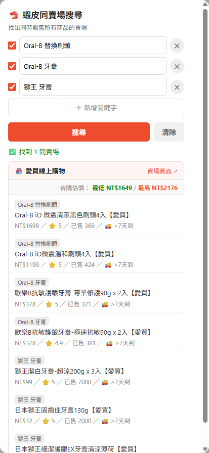
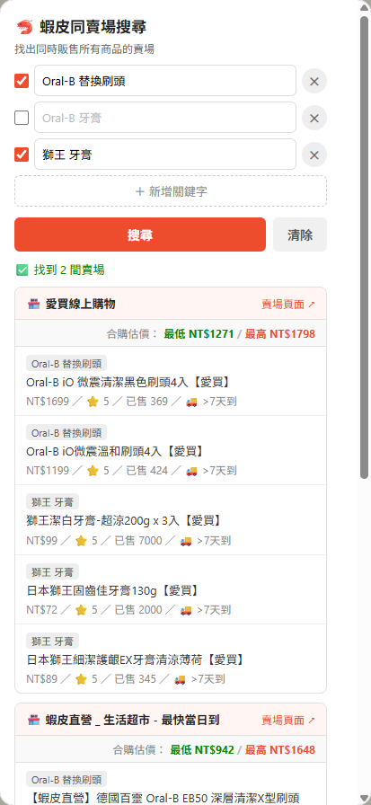

# 🦐 蝦皮同賣場搜尋 Chrome 擴充功能

輸入多個關鍵字，自動找出**同時販售所有指定商品**的蝦皮賣場。


---

## 使用情境

在蝦皮向多個賣場分開下單，每筆都要負擔運費。集中在同一賣場下單，才能達到免運門檻。

例如：輸入「Oral-B 替換刷頭」和「Oral-B 牙膏」，找出同時有賣這兩樣的賣場，**合併購買達到免運門檻，省下多筆運費**。

---

## Demo

| 輸入關鍵字 | 搜尋結果 | 勾選調整後結果 |
|:---:|:---:|:---:|
|  |  |  |

> 第三張：取消勾選「Oral-B 牙膏」後重新搜尋，結果從 1 間擴展為 2 間賣場

---

## 安裝方式

1. 下載或 clone 此專案
2. 開啟 Chrome，網址列輸入 `chrome://extensions/`
3. 右上角開啟「**開發人員模式**」
4. 點「**載入未封裝項目**」，選擇 `shopee-finder` 資料夾
5. 擴充功能圖示出現在工具列即完成

> 同樣適用於 Microsoft Edge（`edge://extensions/`）

---

## 使用方式

1. 在 Chrome 登入 [shopee.tw](https://shopee.tw)
2. 點擊工具列的 🦐 圖示開啟搜尋面板
3. 預設提供兩個關鍵字輸入框，可按「＋ 新增關鍵字」增加更多
4. 有 3 個以上關鍵字時，可透過左側勾選框暫時停用某個關鍵字，不需刪除
5. 按「搜尋」，等待結果
6. 結果依賣場顯示，包含各商品價格、評分、已售數量、到貨時間，以及**合購估價**
7. 點擊商品或賣場連結可直接前往，**關閉面板後結果仍會保留**

---

## 運作原理

此擴充功能不直接呼叫蝦皮 API，而是：

1. 在背景導航至蝦皮搜尋頁，讓蝦皮自己的 JavaScript 執行搜尋
2. 透過注入的 `interceptor.js` 攔截搜尋回應
3. 對所有關鍵字的結果取**賣場交集**，找出同時出現的賣場

此設計完全依賴使用者已登入的瀏覽器 session，無需輸入帳號密碼，也不儲存任何個人資料。

---

## 檔案結構

```
shopee-finder/
├── manifest.json     # 擴充功能設定（Manifest V3）
├── background.js     # 背景 Service Worker，負責搜尋邏輯
├── interceptor.js    # 注入至蝦皮頁面，攔截 API 回應
├── popup.html        # 使用者介面
├── popup.js          # 介面互動邏輯
└── style.css         # 樣式
```

---

## 注意事項

- 需要**先在 Chrome 登入蝦皮**才能使用
- 搜尋時會在背景短暫切換分頁，屬於正常行為
- 每次搜尋最多抓取各關鍵字前 20 筆結果；若找不到交集，可嘗試縮減關鍵字數量

---

## 後續計畫

- [x] 賣場合購估價顯示（最低 / 最高合計）
- [x] 到貨時間顯示
- [x] 關鍵字勾選，暫時停用而不刪除
- [ ] 賣場免運門檻顯示
- [ ] 搜尋結果依合購估價排序
